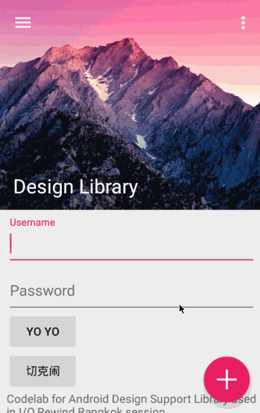

# Android Design Support Library Demo
参考以下三篇 Blog 练习 Android Design Support Library 中控件的使用。

* [参考 1](http://inthecheesefactory.com/blog/android-design-support-library-codelab/en)
* [参考 2](http://blog.csdn.net/eclipsexys/article/details/46349721)
* [参考 3](https://medium.com/ribot-labs/exploring-the-new-android-design-support-library-b7cda56d2c32)

使用了以下控件：Snackbar，FAB, CoordinatorLayout, Toolbar, AppBarLayout, CollapsingToolbarLayout, NestedScrollView, TextInputLayout, DrawerLayout, NavigationView。

#### 截图

带 TabLayout 的中间版本：

最后版本：

Demo 中使用到的图片皆来自网络，主要来自上面三篇 Blog 以及[花瓣网](http://huaban.com/)。
