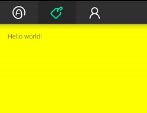

# Embedded TabBar Demo
参考 [这篇博客](http://codethink.me/2014/09/14/2014-09-14-embedded-tab-bar/) 进行的练习。

但实现效果有所区别。我的例子中使用了 appcompat support library，而作者没有使用。

使用了 appcompat 库后，在设置 theme 时，有些属性不需要加 `android:` 前缀。具体原因看此 [链接](http://stackoverflow.com/questions/18726865/custom-style-action-bar-not-working-in-android-4)。如下所示：

    <!-- Base application theme. -->
    

    

    

    

#### 截图

最后的效果并没有达到和原作者一样，tabbar 的左侧和上侧还有一些额外的 padding，尝试了几种修改都未能解决。

#### 2015/8/6

感谢作者 [Archie Yang](https://github.com/archieyang)，经过他的指点，修改 style 如下，达到了和作者一样的效果。  
增加了 `actionBarSize`, `contentInsetStart`, `contentInsetEnd` 三个属性。

代码：

    <!-- Base application theme. -->
    

    

    

    

修改后的截图：

受此启发，解决另一个问题。在我的真机 (MX4 Pro, Android 4.4, API 19) 上，tabbar 各 tab 的宽度总是为一个固定的值，而且比高度多不少，很是莫名其妙，但在 android 5.0 模拟器上正常的，如下图所示。

跟踪 `Widget.AppCompat.Light.ActionBar.TabView`，发现在 < API 21 时，它有一项 minWidth 的属性，值为 80dp。如下所示：

    

但在 >= API 21 时是没有这项属性的。

于是修改 style，增加 `android:minWidth` 属性值，这里我把它改成了 0dp，如下所示：

    

效果图如下：

这样就比较完美了。
